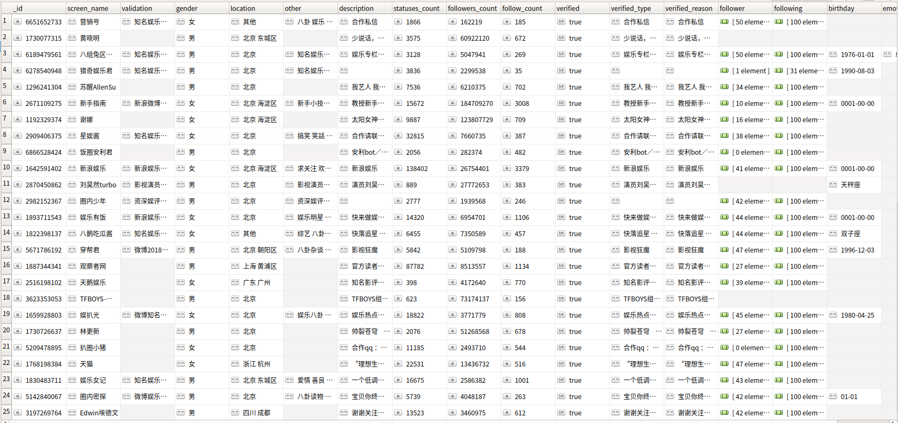
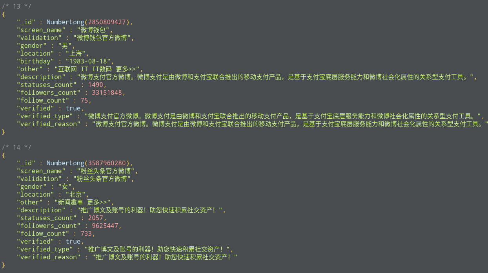

# Weibo

===

```
├── crawl_by_api2.0
│   ├── down_post_comments_api2.0.ipynb
│   ├── sinaweibopy3.py
│   └── weibo_api2.0.ipynb
├── crawl_by_python
│   ├── down_post_comments.py
│   ├── down_user_info.py
│   ├── down_user_posts.py
│   ├── proxy_hellper
│   │   ├── CheckProxy.py
│   │   ├── getFreeProxy.py
│   │   ├── proxies.txt
│   │   └── Util
│   │       ├── __init__.py
│   │       ├── LogHandler.py
│   │       ├── utilFunction.py
│   │       └── WebRequest.py
│   └── weibo_crawl.ipynb
└── README.md
```



